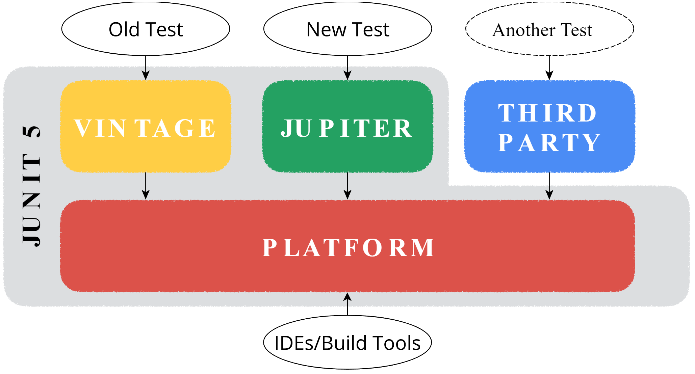

# Testing In The
# Modular World

---

#### Testing In The Modular World

_"Can't say what I'm doing here_

_But I hope to see much clearer,_

_After living in the material world."_

**George Harrison**

+++

#### Testing In The Modular World
## Overview
<br>

@ul

- Using **JUnit 5** ✅ to launch tests
- Organized in **Java Modules** ☕
- Foundation tools **`javac`** and **`java`**

@ulend

---

# What is JUnit 5?

+++

## There is **no** JUnit 5

+++
 
#### JUnit 5 = ...
# Platform
<br>

@ul

- Foundation for launching testing frameworks
- Defines and uses `TestEngine` interface

@ulend

+++
 
#### JUnit 5 = Platform + ...
# Jupiter
<br>

@ul

- New programming model for writing tests
- New extension model for writing extensions
- `JupiterTestEngine implements TestEngine`

@ulend

+++
 
#### JUnit 5 = Platform + Jupiter + ...
# Vintage
<br>

@ul

- Enables running JUnit 3 and JUnit 4 tests
- `VintageTestEngine implements TestEngine`

@ulend

+++

#### JUnit 5 = Platform + Jupiter + Vintage + ...
# Your Engine
<br>

@ul

- What is a test? **You define it!**
- How is a test evaluated? **You define it!**
- `YourTestEngine implements TestEngine`

@ulend

---

# This is JUnit 5

+++




+++


---

# Jupiter Test Engine

+++

### First Jupiter Test

```java
import org.junit.jupiter.api.*;

class FirstJupiterTests {

    @Test
    void myFirstTest() {
        Assertions.assertEquals(2, 1 + 1, "2 is two");
    }

}
```

@[1](Import JUnit Jupiter API)
@[3,6](Use 'package-private' modifier)
@[5-8](@Test-annotated method, also 'package-private')
@[1-8]

+++

### Meta-Annotations

```java
@Tag("fast")
@Tag("system")
@Test
@interface FastSystemTest {}

@FastSystemTest
void mySecondTest() {...} 
```

@[1-2](Multiple tags)
@[3](Mark as test)
@[6-7](Use your meta-annotation)
@[1-7]

+++

#### Jupiter Features 1
<br>

@ul

- Basic Annotations - *`@Test`*
- Meta-Annotations - *`@FastSystemTest`*
- Display Names - *Emojis! 😎 🐌* @note[Spaces in names...]
- Tagging and Filtering
- Assertions @note[Use external assertion libs. They are good!]
- Assumptions
- Disabling Tests
- Conditional Test Execution

@ulend

+++

### Jupiter Features 2
<br>

@ul

- Test Instance Lifecycle
- Nested Tests
- Dependency Injection
- Test Interfaces
- Repeated Tests - 🔂
- Dynamic Tests
- Test Templates
- Parameterized Tests - ✨

@ulend

+++

### Jupiter Features 3
# User Guide
<br>

https://junit.org/junit5/docs/current/user-guide/

Note:
The user guide contains the latest documentation and usage examples.
Most of it explains the Jupiter API and programming model.
Platform and Vintage are covered, too.

---

# JPMS

[Modules] are named, self-describing program components consisting of code and data. A module must be able to contain Java classes and interfaces, as organized into packages, and also native code, in the form of dynamically-loadable libraries. A module’s data must be able to contain static resource files and user-editable configuration files.
[http://openjdk.java.net/projects/jigsaw/spec/reqs/02#modules]

---

# What is a module?
- Named
- Set of packages (code and data)
- Module Metadata (module-info.class)

+++

# Simple Jar

- `com.example.tool-1.9.jar`
  - _com.example.tool_ 
  - _com.example.tool.internal_ 

+++

# Module Descriptor

module-info.java
```java
module com.example.tool {
  exports com.example.tool;
}
```

+++

# Modular Jar

- com.example.tool.jar
- + module-info.class
-   com.example.tool
-   ~com.example.tool.internal~

---

# Modular World

https://github.com/junit-team/junit5-samples/blob/master/README.md
